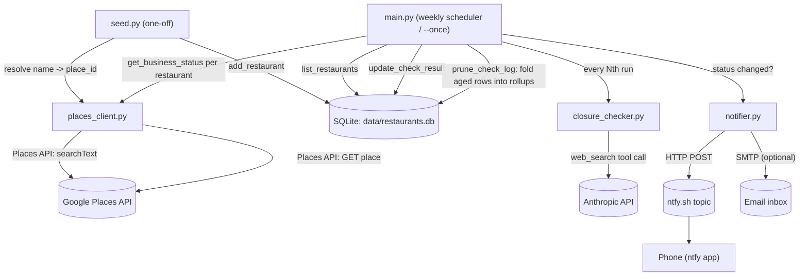

# Restaurant Watcher — Working Plan

_Last reviewed: 2026-09-17, against 6 commits through `b55288a` ("Adding new tests")
plus uncommitted work (`main.py`'s move to call-time config, `closure_checker.py`'s
explicit retry/timeout config and the graceful degradation of a failed news check) —
7 modules + 4 test files, ~1500 lines. This plan tracks open work only; finished items
(HTTP retries everywhere including the Anthropic SDK, the test suite, email
notifications, log pruning, call-time config, `run_check` coverage, the
notify-on-transition fixes) are dropped once done — see git history for what landed._

## 1. Technical Overview

**Stack:** Python 3.13, SQLite (stdlib `sqlite3`), `requests` for HTTP, `anthropic` SDK,
`apscheduler` for the weekly loop, `python-dotenv` for config, `pytest` for tests.
`flask` is listed in `requirements.txt` but **still not used anywhere** — dead
dependency, no web server exists yet (see Phase 2).

**Core components** (one file each, no package structure):

| File | Role |
|---|---|
| `main.py` | Orchestrator. Loads env, runs the check loop (once or via `BlockingScheduler`), decides which restaurants get the expensive news check this run, and kicks off log pruning afterwards. Cadence/retention config is read per run via `_closing_soon_check_every()` / `_check_log_retain_days()`. |
| `db.py` | SQLite schema + CRUD. Three tables: `restaurants` (current state), `check_log` (recent per-check history) and `check_log_monthly` (rollups of pruned `check_log` rows). Also `prune_check_log()` and `check_history()`. |
| `places_client.py` | Thin wrapper around Google Places API (New): `find_place_id` (seed-time text search) and `get_business_status` (per-run cheap status poll). Retries via a `urllib3` `Retry` adapter. |
| `closure_checker.py` | Calls Claude (`claude-sonnet-4-6`) with the `web_search` tool to judge if a restaurant has announced closure news. Returns structured JSON. Retries/timeout are set explicitly on the SDK client rather than inherited. |
| `notifier.py` | Pushes alerts to a phone via [ntfy.sh](https://ntfy.sh/) (HTTP POST, no auth) and, optionally, by email over SMTP. |
| `seed.py` | One-time/occasional CLI: reads a text file of restaurant names, resolves each to a Google `place_id`, inserts into the DB. |

**How they fit together:**

Everything is single-threaded, synchronous, and stateless between runs except for what's
persisted in SQLite and a plain-text run counter (`data/.run_count`).

## 2. Current Architecture

### Data flow
1. **Seed once:** `seed.py` reads `restaurants.txt` → `find_place_id()` resolves each line
   to a Google Place ID via Text Search → row inserted into `restaurants`.
2. **Each scheduled run** (`main.run_check`):
   - Increments a persistent run counter (`data/.run_count`) to decide if this is a
     "news check" run (every `CLOSING_SOON_CHECK_EVERY`, default 4).
   - For every active (non-archived) restaurant: fetch `businessStatus` from Places.
   - If operational and it's a news-check run: ask Claude (with web search) whether
     recent coverage suggests an impending closure. A news check that fails after its
     retries is logged and skipped, not fatal: the restaurant keeps the Places status
     just fetched and carries its stored closing-soon flag forward, exactly as on a
     plain run.
   - Write the result to `restaurants` (current state) and append a row to `check_log`
     (history/audit trail).
   - Compare new status to the previously stored status to decide whether to notify.
   - A per-restaurant failure is caught, logged with a traceback and counted, so one bad
     restaurant never aborts the run; the tally is logged at the end.
   - After the loop, `prune_check_log()` folds aged-out `check_log` rows into
     `check_log_monthly` (housekeeping only -- a failure here is logged, not fatal).
3. **Permanent closures auto-archive** the restaurant (`archived = 1`, excluded from
   future `list_restaurants(active_only=True)` calls). Temporary closures and
   closing-soon flags stay active so they keep surfacing on later runs.

### Test coverage
`tests/` covers `db` (state transitions, pruning, rollups), `closure_checker` (JSON
extraction from messy model output, plus the client's retry/timeout config), `notifier`
(call-time config, email fallbacks, failure isolation) and, as of 2026-09-17,
`main.run_check` — news-check cadence, notify-on-transition, the closing-soon flag,
per-restaurant failure isolation, news-check failure degradation and housekeeping.
`test_main.py` fakes the three external calls and runs against a real temp SQLite file,
so the transitions it asserts are the same reads and writes production does — it caught
two live notification bugs on the way in (both since fixed). 48 tests, all passing.
`seed.py` and `places_client.py` remain uncovered (both are thin HTTP wrappers).

### External API integrations
- **Google Places API (New)** — the only restaurant-status source today. Two calls:
  - `places:searchText` (seed time only) — resolves name/address to a `place_id`.
  - `GET /places/{id}` (every run) — field mask kept to `id,businessStatus,displayName`
    deliberately, to stay in the cheap Essentials/Pro pricing tier (README calls this
    out explicitly — adding fields like `rating` or `currentOpeningHours` bumps the
    *entire call* to Enterprise pricing).
  - **No Resy or OpenTable integration exists in this codebase.** `notifier.py`'s
    docstring references sharing an ntfy topic with "the reservation notifier," implying
    a separate/sibling tool the user has elsewhere — but reservation-availability
    watching (Resy/OpenTable) is not implemented here. See Phase 1 below.
- **Anthropic API** — `claude-sonnet-4-6` with the `web_search_20250305` tool, used
  only for the low-frequency "closing soon" judgment call. Prompted for strict JSON;
  `closure_checker.py` defensively extracts the `{...}` substring since the model
  sometimes wraps it in prose.
  - Retries are the SDK's own loop (exponential backoff, honors `retry-after`, covers
    connection/timeout errors plus 408/409/429/5xx), so there is no `urllib3` adapter
    to mount here — but `MAX_RETRIES = 3` and `TIMEOUT_SECONDS = 120` are set
    explicitly on the client instead of inheriting the SDK defaults (2 retries and a
    600s read timeout, which would stall the serial loop for ten minutes on one hung
    request). `tests/test_closure_checker.py` pins both.
  - Failures that survive the retries propagate out of `check_closing_soon()`; the
    caller decides what they mean (see the data flow above), so a bad Anthropic day
    costs the news signal, not the status check.

### Notification pipeline
- `notifier.py` fans one `notify()` call out to two sinks:
  - **ntfy** — HTTP POST to `https://ntfy.sh/{NTFY_TOPIC}`, no auth (the topic name is
    the only "secret"), no delivery confirmation. Retries on 429/5xx via the shared
    session adapter.
  - **Email (optional)** — SMTP with STARTTLS, active only when `SMTP_HOST`,
    `EMAIL_FROM` (or `SMTP_USER`) and `EMAIL_TO` are all set; `_email_settings()`
    returns `None` otherwise and the send is skipped. Failures are caught and logged,
    so a broken mail server never breaks the ntfy alert or the run.
- Two notification types:
  - `notify_closed` (high priority) — fires on any change *into*
    `CLOSED_TEMPORARILY`/`CLOSED_PERMANENTLY`, including temporary → permanent, which
    is a distinct event worth hearing about.
  - `notify_closing_soon` (default priority) — fires when `closing_soon_flag` goes
    0 → 1. Only a news check can move that flag; plain runs carry the stored value
    forward, so the alert is sent once per closure story rather than once per news
    cycle. A later news check finding no signal clears the flag and re-arms the alert.
- Archiving keys off the status (`CLOSED_PERMANENTLY`), not the transition, so a row
  stranded active by a failed run still leaves the active list on the next one.
- No dedup/backoff beyond these state-transition checks in `main.py`; no notification
  log. `tests/test_main.py` is what pins all of this down.

### Gaps / risks worth knowing about
- `flask` dependency is unused — either build the dashboard it implies (Phase 2) or drop it.

## 3. Phased Work Plan

### Phase 1 — Reservation availability watching (Resy/OpenTable)
This is the natural "new feature," and matches what `notifier.py`'s docstring implies
is a sibling concern:
- New module (e.g. `reservation_client.py`) polling Resy and/or OpenTable for open
  tables at specific restaurants/party sizes/date windows — useful for hard-to-book
  places distinct from the "is it still open" check this repo already does.
- Both platforms' consumer APIs are unofficial/reverse-engineered (no public partner
  API for this use case) — worth explicitly deciding on rate limits, auth/cookie
  handling, and ToS risk before building, since this is different in kind from the
  Places API usage above.
- Reuse the existing `restaurants` table (add columns) or a new `reservation_watches`
  table if watches need their own party-size/date-range/cadence config per restaurant.
- New notification type via the existing `notifier.py` (`notify_table_available`).

### Phase 2 — Minimal dashboard (justifies the `flask` dependency)
- Single-page Flask view: list of tracked restaurants with current status, last
  checked time, and closing-soon summaries pulled straight from `db.py`.
  `check_history()` already returns per-month rollups suited to a history panel.
- Manual actions: add a restaurant (wraps `seed.py`'s logic instead of editing a text
  file), re-activate an archived one, force a check now.
- If this isn't wanted, remove `flask` from `requirements.txt` instead — don't leave
  it unused indefinitely.

### Phase 3 — Efficiency / scale polish (once restaurant count grows)
- Batch Places status checks if/when Google's API supports it, or at least add
  concurrency (`concurrent.futures`) to the per-restaurant loop — currently fully serial.
- Per-restaurant check cadence instead of one global schedule (e.g. check closing-soon
  news more often for restaurants already flagged once).

## 4. Concrete Next Steps (start of next session)
1. Commit the pending work (`main.py`'s call-time config, `closure_checker.py`'s
   explicit retry/timeout config, the failed-news-check degradation and their tests) —
   the tree has been clean at every other checkpoint.
2. Decide Resy/OpenTable scope for Phase 1 (which platform first, what auth approach) —
   this is the biggest unknown and worth a short spike before committing to a design.
3. Decide `flask`'s fate: build Phase 2's minimal dashboard, or drop the dependency.
