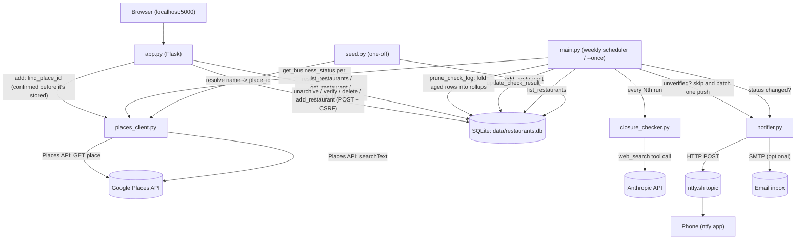

# Restaurant Watcher — Working Plan

_Last reviewed: 2026-09-17, against 9 commits through `e1f9d2b` ("Users can now add
restaurants through the dashboard") plus uncommitted work: the first-check
verification gate (`db.verified_at` + migration, `main.run_check` skipping unverified
rows, `notifier.notify_needs_verification()`, the dashboard's verify/reject routes and
pending section) and the ntfy header-encoding fix it turned up. The tests are
comfortably the largest part of the repo. This plan tracks open work only; finished
items (HTTP retries everywhere including the Anthropic SDK, the test suite, email
notifications, log pruning, call-time config, `run_check` coverage, the
notify-on-transition fixes, the ntfy emoji-title bug, and Phase 2's read-only view,
re-activate action, add-a-restaurant flow and verification gate) are dropped once
done — see git history for what landed._

## 1. Technical Overview

**Stack:** Python 3.13, SQLite (stdlib `sqlite3`), `requests` for HTTP, `anthropic` SDK,
`apscheduler` for the weekly loop, `python-dotenv` for config, `pytest` for tests,
`flask` for the dashboard (`app.py` + `templates/`, added 2026-09-17 — no longer the
dead dependency it was).

**Core components** (flat, no package structure — one module per role, plus the
dashboard's templates):

| File | Role |
|---|---|
| `main.py` | Orchestrator. Loads env, runs the check loop (once or via `BlockingScheduler`), splits the active list into verified (checked) and unverified (skipped entirely, one batched push per run), decides which restaurants get the expensive news check this run, and kicks off log pruning afterwards. Cadence/retention config is read per run via `_closing_soon_check_every()` / `_check_log_retain_days()`. |
| `db.py` | SQLite schema + CRUD. Three tables: `restaurants` (current state), `check_log` (recent per-check history) and `check_log_monthly` (rollups of pruned `check_log` rows). Also `prune_check_log()`, `check_history()`, `get_restaurant()`, `get_restaurant_by_place_id()` (the add flow's "already tracking this?" check — `add_restaurant()` dedupes by quietly ignoring the insert, so nothing else can tell), `unarchive_restaurant()` (the inverse of `archive_restaurant()`; touches only `archived`), `verify_restaurant()` (writes `verified_at` once, so a double submit reports a repeat rather than moving the date) and `delete_restaurant()` (row + `check_log` + rollups; the wrong-match path). `init_db()` also settles any `closing_soon_flag` left set on a permanently closed row, and runs `_migrate()` — the one ALTER that adds `verified_at`, backfilling it for rows that had already been checked so an existing install doesn't silently stop watching everything. |
| `places_client.py` | Thin wrapper around Google Places API (New): `find_place_id` (text search, at seed time and behind the dashboard's add form) and `get_business_status` (per-run cheap status poll). `place_summary()` flattens a search hit into the columns `add_restaurant()` takes, shared by `seed.py` and `app.py` so the two can't disagree about what gets stored. Retries via a `urllib3` `Retry` adapter. |
| `closure_checker.py` | Calls Claude (`claude-sonnet-4-6`) with the `web_search` tool to judge if a restaurant has announced closure news. Returns structured JSON. Retries/timeout are set explicitly on the SDK client rather than inherited. |
| `notifier.py` | Pushes alerts to a phone via [ntfy.sh](https://ntfy.sh/) (HTTP POST, no auth) and, optionally, by email over SMTP. Three alerts: closed, closing-soon, and needs-verification (batched — one per run, not one per restaurant). `_header_value()` RFC 2047-encodes non-ASCII header values; ntfy carries the title in a header, and `http.client` encodes headers as latin-1, so every emoji title raised `UnicodeEncodeError` before the request left. |
| `seed.py` | One-time/occasional CLI: reads a text file of restaurant names, resolves each to a Google `place_id`, inserts into the DB. |
| `app.py` | Flask dashboard. `/` lists every restaurant with status/last-checked age plus the add-a-restaurant search box, `/restaurant/<id>` adds the per-month history, `POST /restaurant/<id>/unarchive` re-activates an archived one, `POST /restaurant/<id>/verify` and `POST /restaurant/<id>/reject` settle an unverified one, and `POST /add` → `GET,POST /add/confirm` is the two-step add (see the data flow below). Reads and writes through `db.py`; the only external call it makes is that one Text Search. No module-level `app`, so importing it has no side effects (Flask's loader finds `create_app()`). Forms carry a session CSRF token (`DASHBOARD_SECRET_KEY`, generated per process if unset). |
| `templates/` | `base.html` (layout, light/dark tokens, flash messages), `index.html`, `detail.html`, `confirm_add.html` (the "is this the right place?" step), and `_status.html` — macros for the status badges, the re-activate form and the verify/reject pair, shared so the two pages can't disagree about what a state looks like. The badge macro reads `status_known` rather than the status itself, since the column defaults to `OPERATIONAL` and an unverified row is never checked — it would otherwise claim to be open on the strength of a default, forever. Presentation decisions that a count on the page also depends on live in `app._view()`, not in the templates. |

**How they fit together:**

Everything is single-threaded, synchronous, and stateless between runs except for what's
persisted in SQLite and a plain-text run counter (`data/.run_count`).

## 2. Current Architecture

### Data flow
1. **Getting restaurants in:** `seed.py` reads `restaurants.txt` → `find_place_id()`
   resolves each line to a Google Place ID via Text Search → row inserted into
   `restaurants`, **unverified**. The dashboard does the same thing one at a time,
   with a confirm step in between (step 5), and stores the result already verified —
   that page is the same question asked before the row exists rather than after.
2. **Verification gates the whole check** (step 6): an unverified row is skipped
   entirely by `run_check`, so nothing is spent on it and no alert can fire about it.
3. **Each scheduled run** (`main.run_check`):
   - Increments a persistent run counter (`data/.run_count`) to decide if this is a
     "news check" run (every `CLOSING_SOON_CHECK_EVERY`, default 4).
   - Splits the active list into verified and unverified in one read, so the count
     that gets notified about and the list that got skipped can't disagree.
   - For every active, **verified** restaurant: fetch `businessStatus` from Places.
   - If operational and it's a news-check run: ask Claude (with web search) whether
     recent coverage suggests an impending closure. A news check that fails after its
     retries is logged and skipped, not fatal: the restaurant keeps the Places status
     just fetched and carries its stored closing-soon flag forward, exactly as on a
     plain run.
   - Write the result to `restaurants` (current state) and append a row to `check_log`
     (history/audit trail).
   - Compare new status to the previously stored status to decide whether to notify.
   - A per-restaurant failure is caught, logged with a traceback and counted, so one bad
     restaurant never aborts the run; the tally is logged at the end.
   - After the loop, one `notify_needs_verification()` push covers everything
     unverified, then `prune_check_log()` folds aged-out `check_log` rows into
     `check_log_monthly`. Both are isolated: a failure is logged, not fatal, so a
     dead ntfy can't throw away check results already written.
4. **Permanent closures auto-archive** the restaurant (`archived = 1`, excluded from
   future `list_restaurants(active_only=True)` calls) and clear `closing_soon_flag`:
   the flag predicts a future closure, so the closure landing settles it, and this
   is the last run that can — the row is archived from here on and the news check
   that owns the flag only runs on `OPERATIONAL` places. `closing_soon_summary` is
   kept as the record of what was predicted. Temporary closures and their
   closing-soon flags stay active so they keep surfacing on later runs.
   `db.init_db()` sweeps the same invariant over rows written before this existed,
   which are unreachable from `run_check` for exactly the reason above.
5. **Un-archiving is manual** and only from the dashboard, for a place that reopened
   or that Google had wrong. It flips `archived` and nothing else, so it can't
   re-fire a closure alert — but because step 3 keys off the status rather than the
   transition, a row whose stored status is still `CLOSED_PERMANENTLY` gets archived
   again by the next run (silently, since nothing changed). The dashboard warns about
   exactly that case when it happens.
6. **Adding from the dashboard is two steps**, because Text Search always answers with
   exactly one best guess and no confidence beside it — a wrong "Lilia" being watched
   looks identical to a right one. `POST /add` spends the search, stashes the candidate
   in the session and redirects; `GET /add/confirm` shows name, address and Maps link;
   `POST /add/confirm` writes the row from the **session** copy, with the posted
   `place_id` used only to check the form matches the search it came from. Three
   consequences worth keeping: the redirect means reloading the confirm page doesn't
   re-buy the search; a name already tracked skips the confirm and redirects to its
   existing row (`get_restaurant_by_place_id()`), archived ones included, since
   `add_restaurant()`'s `INSERT OR IGNORE` would otherwise read as a successful add;
   and a search that fails or matches nothing is a flash message, never a 500 — this
   page is where an unset `GOOGLE_PLACES_API_KEY` surfaces.
7. **Verifying is that same confirm step, asked late**, for the rows nobody looked at
   — `seed.py` resolves a whole file with no one watching. Unverified restaurants
   collect at the top of the index with address and Maps link. **Yes** writes
   `verified_at` and nothing else. **Wrong place** deletes the row *and* its history
   (that history describes a different restaurant) and redirects to the index with
   `?q=<name>` so the search box is prefilled — the name only, since the stored
   address is the wrong place's and would just find it again. Reject is the only
   destructive route here, so it's scoped to unverified rows: a stale tab can't throw
   away a restaurant confirmed a year ago. `app._view()`'s `needs_verification` is
   defined as unverified-and-unarchived, matching exactly what `run_check` skips,
   because that loop only reads the active list.

### Test coverage
`tests/` covers `db` (state transitions, pruning, rollups), `closure_checker` (JSON
extraction from messy model output, plus the client's retry/timeout config), `notifier`
(call-time config, email fallbacks, failure isolation) and, as of 2026-09-17,
`main.run_check` — news-check cadence, notify-on-transition, the closing-soon flag,
per-restaurant failure isolation, news-check failure degradation, the flag being
settled by a permanent closure (but not a temporary one) and housekeeping —
and `app` (rendering, sort order, summary counts, archived rows staying visible,
UTC timestamp handling, staleness) — plus the un-archive POST: that it changes only
`archived`, is rejected without a valid CSRF token, is unreachable by GET, warns on a
still-permanently-closed row, and can't be steered into an off-site redirect. Two of
those tests exist to stop specific drift rather than to cover a branch: one posts a
token scraped from a rendered page (the rest seed the session, so nothing else would
notice the form and the check disagreeing), and one asserts the closing-soon count in
the summary matches the badges actually on screen.
`test_main.py` fakes the three external calls and runs against a real temp SQLite file,
so the transitions it asserts are the same reads and writes production does — it caught
two live notification bugs on the way in (both since fixed). `test_app.py` uses the same
real-DB-in-tmp_path setup through Flask's test client.

The add flow is tested for a second thing besides correctness: that the paid call
*doesn't* happen. An empty box, a rejected CSRF token and a GET each assert
`find_place_id` was never called, and reloading the confirm page asserts the search ran
once. The rest cover the failure modes that have a wrong-but-plausible alternative —
a place already tracked (redirect to its row, no duplicate), a double-submitted confirm
(reports "already tracked", not a second add), a confirm whose `place_id` doesn't match
the search (400, nothing stored), an expired session, no match, and a dead Places API.
`tests/test_places_client.py` is new and covers only `place_summary()`, the pure
name/address mapping both callers share.

The verification gate is tested on both sides: that an unverified restaurant costs
nothing and stores nothing (no Places call, no Claude call, no `check_log` row, and a
`CLOSED_PERMANENTLY` it never saw can't archive it), that one unverified row holds up
only itself, that verifying lifts the gate on the next run, and that the push is one
per run however many are waiting. On the dashboard: that verifying writes `verified_at`
and nothing else, that rejecting takes the history with it and prefills the search,
that rejecting a *verified* row is a 400, and that neither runs without CSRF or over
GET. `test_notifier.py` gained the round trip that the emoji-title bug broke — the
header has to be latin-1 safe *and* decode back to the original text.

144 tests, all passing (`app` 62, `main` 34, `db` 19, `notifier` 12, `closure_checker` 8,
`places_client` 6, `seed` 3). The HTTP halves of `places_client.py` remain uncovered — faking
`requests` there would only assert the mock. `tests/test_seed.py` covers
seed.py's wiring rather than its network half: that it loads `.env` at import
(it didn't, so seeding failed asking for a key that was already in `.env` —
it was the one entry point that never called `load_dotenv()`), that seeded
rows land unverified, and that an unresolvable line is skipped rather than
fatal.

### External API integrations
- **Google Places API (New)** — the only restaurant-status source today. Two calls:
  - `places:searchText` (seed time only) — resolves name/address to a `place_id`.
  - `GET /places/{id}` (every run) — field mask kept to `id,businessStatus,displayName` deliberately, to stay in the cheap Essentials/Pro pricing tier (README calls this out explicitly — adding fields like `rating` or `currentOpeningHours` bumps the *entire call* to Enterprise pricing).
  - **No Resy or OpenTable integration exists in this codebase.** `notifier.py`'s docstring references sharing an ntfy topic with "the reservation notifier," implying a separate/sibling tool the user has elsewhere — but reservation-availability watching (Resy/OpenTable) is not implemented here. See Phase 1 below.
- **Anthropic API** — `claude-sonnet-4-6` with the `web_search_20250305` tool, used only for the low-frequency "closing soon" judgment call. Prompted for strict JSON; `closure_checker.py` defensively extracts the `{...}` substring since the model sometimes wraps it in prose.
  - Retries are the SDK's own loop (exponential backoff, honors `retry-after`, covers connection/timeout errors plus 408/409/429/5xx), so there is no `urllib3` adapter to mount here — but `MAX_RETRIES = 3` and `TIMEOUT_SECONDS = 120` are set explicitly on the client instead of inheriting the SDK defaults (2 retries and a 600s read timeout, which would stall the serial loop for ten minutes on one hung request). `tests/test_closure_checker.py` pins both.
  - Failures that survive the retries propagate out of `check_closing_soon()`; the caller decides what they mean (see the data flow above), so a bad Anthropic day costs the news signal, not the status check.

### Notification pipeline
- `notifier.py` fans one `notify()` call out to two sinks:
  - **ntfy** — HTTP POST to `https://ntfy.sh/{NTFY_TOPIC}`, no auth (the topic name is the only "secret"), no delivery confirmation. Retries on 429/5xx via the shared session adapter.
  - **Email (optional)** — SMTP with STARTTLS, active only when `SMTP_HOST`, `EMAIL_FROM` (or `SMTP_USER`) and `EMAIL_TO` are all set; `_email_settings()` returns `None` otherwise and the send is skipped. Failures are caught and logged, so a broken mail server never breaks the ntfy alert or the run.
- Two notification types:
  - `notify_closed` (high priority) — fires on any change *into* `CLOSED_TEMPORARILY`/`CLOSED_PERMANENTLY`, including temporary → permanent, which is a distinct event worth hearing about.
  - `notify_closing_soon` (default priority) — fires when `closing_soon_flag` goes 0 → 1. Only a news check can move that flag; plain runs carry the stored value forward, so the alert is sent once per closure story rather than once per news cycle. A later news check finding no signal clears the flag and re-arms the alert, as does the
    permanent closure that ends the story — so a place that turns out to be open after all
    and is later reported closing again is heard about a second time.
- Archiving keys off the status (`CLOSED_PERMANENTLY`), not the transition, so a row stranded active by a failed run still leaves the active list on the next one. Same mechanism re-archives a manually un-archived row whose status hasn't changed — see data flow step 4.
- No dedup/backoff beyond these state-transition checks in `main.py`; no notification log. `tests/test_main.py` is what pins all of this down.

### Gaps / risks worth knowing about
- The dashboard has no auth and binds to localhost only. Fine as-is; it becomes a real decision the moment anyone wants it reachable from a phone, which is also the point where the personal restaurant list stops being local-only data. The add form raises the stakes slightly: a page that spends money per click is worse to expose than one that only reads.
- The add flow has no rate limit — nothing stops a held-down Enter key from running one Text Search per submit. Acceptable for one user pressing a button on localhost, and the first thing to revisit if this is ever exposed or scripted.
- It's served by Flask's development server. Fine for a personal tool on localhost; a real deployment needs a WSGI server in front.
- CSRF tokens live in a session cookie signed with `DASHBOARD_SECRET_KEY`. Unset, a per-process key is generated and open pages stop working after a restart (a reload fixes it). That's the right trade for one user on localhost and the wrong one the moment the app is served to anything else.
- **Verifying is one-at-a-time, and `restaurants.txt` is 531 lines.** Seeding the
  real file would leave 531 rows to click through individually, with `run_check`
  checking none of them until that's done. A "verify all" (or verify-by-page) action
  is the obvious escape hatch and isn't built; whether it's wanted depends on whether
  the list is trusted in bulk, which rather defeats the point for the ambiguous names
  in it. Worth deciding before seeding, not after.
- The needs-verifying push re-fires every run while anything is waiting. That's the
  design (those restaurants aren't being watched, so the nag is the point) and it's
  self-limiting at one push a week, but it's the first thing to revisit if a seeded
  file that never gets triaged turns into a standing weekly notification.
- `closing_soon_flag` on a *temporarily* closed place is the one state the flag can still sit in indefinitely: the news check only runs on `OPERATIONAL` rows, so a place that closes temporarily while flagged keeps the flag until it reopens and a news check revisits it. That's deliberate (a place shut "temporarily" that was reported closing for good is exactly what the flag is for), but it means the flag reflects the last news check, not the present, for as long as that lasts. Permanent closures no longer have this problem — see the data flow above.

## 3. Phased Work Plan

### Phase 1 — Reservation availability watching (Resy/OpenTable)
This is the natural "new feature," and matches what `notifier.py`'s docstring implies is a sibling concern:
- New module (e.g. `reservation_client.py`) polling Resy and/or OpenTable for open tables at specific restaurants/party sizes/date windows — useful for hard-to-book places distinct from the "is it still open" check this repo already does.
- Both platforms' consumer APIs are unofficial/reverse-engineered (no public partner API for this use case) — worth explicitly deciding on rate limits, auth/cookie handling, and ToS risk before building, since this is different in kind from the Places API usage above.
- Reuse the existing `restaurants` table (add columns) or a new `reservation_watches` table if watches need their own party-size/date-range/cadence config per restaurant.
- New notification type via the existing `notifier.py` (`notify_table_available`).

### Phase 2 — Dashboard: remaining manual actions
The read-only view, the re-activate action and adding a restaurant have all landed, so
the dashboard is now the place the tool is driven from rather than a viewer — the only
routine reason left to touch a terminal is running the checks. One action is still open:
- **Force a check now** — runs `run_check()` for one restaurant. `run_check` currently
  only does all-or-nothing over the active list and owns the run counter, so a
  single-restaurant path means either a parameter or a narrower extracted helper.
  Doing this from a request thread also makes a page hang on Places/Anthropic latency
  — the add flow doesn't have this problem (one Text Search returns in well under a
  second), but a news check behind the same button would, so this needs its design
  decision made before it's built.
- Auth is still undecided, and is the blocker for serving this anywhere but localhost
  now that buttons on the page change state and spend money.

### Phase 3 — Efficiency / scale polish (once restaurant count grows)
- Batch Places status checks if/when Google's API supports it, or at least add concurrency (`concurrent.futures`) to the per-restaurant loop — currently fully serial.
- Per-restaurant check cadence instead of one global schedule (e.g. check closing-soon news more often for restaurants already flagged once).

## 4. Concrete Next Steps (start of next session)
1. Commit the verification gate and the ntfy header fix (`db.py`, `main.py`, `notifier.py`, `app.py`, `templates/`, `tests/`, README + `.env.example`) — the tree has been clean at every other checkpoint.
2. **Confirm an alert actually arrives on the phone.** The emoji-title bug means no ntfy notification this tool has ever sent can have been delivered — `run_check` caught the `UnicodeEncodeError` inside the per-restaurant `except` and logged it as a failed check. Worth one deliberate `notify()` against the real topic to prove the fix end to end, since every test fakes the POST.
3. Use the add form against the real Places API with a real key. Every test fakes `find_place_id`, so the response *shape* (`displayName.text`, `formattedAddress`, `googleMapsUri` all present on a real hit) is assumed, not verified — and a deliberately ambiguous query is the way to see whether the confirm page actually gives you enough to catch a wrong match.
4. Seed the DB and triage the verify queue against real data. Note `restaurants.txt`
   is 531 lines — that's 531 Text Search calls (order of $15-20) and 531 rows to
   verify by hand, so trim it or build a bulk-verify action first. `data/restaurants.db` exists but holds 0 rows, so the dashboard has only ever been rendered against fixtures — and a full `restaurants.txt` is also the first real test of whether clicking through a long pending list is tolerable, or whether it needs a "verify all" escape hatch.
5. Decide whether "force a check now" is wanted before Phase 1, and if so how it avoids hanging a request thread (background thread, a job row the scheduler picks up, or restricting the button to the cheap Places half).
6. Decide Resy/OpenTable scope for Phase 1 (which platform first, what auth approach) — still the biggest unknown and worth a short spike before committing to a design.
