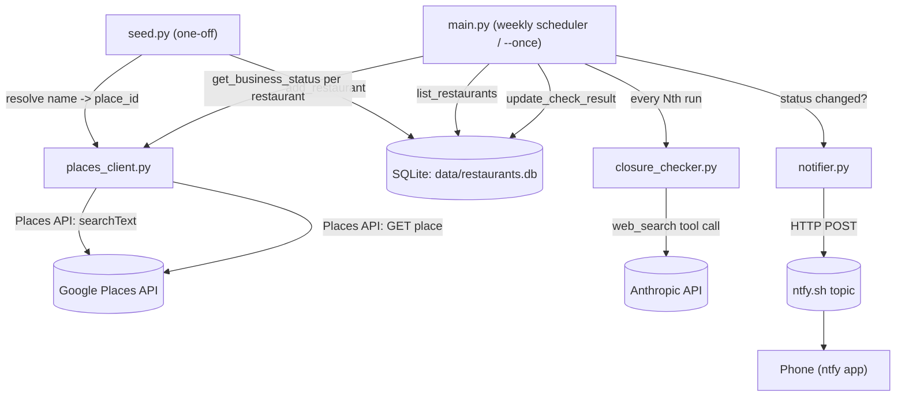

# Restaurant Watcher — Working Plan

_Last reviewed: 2026-09-16, against the single "Initial commit" (8 files, ~425 lines)._
_Updated same day: `.gitignore` added and `main.py` hardened (try/except + logging) —
see Phase 1 status below._

## 1. Technical Overview

**Stack:** Python 3.13, SQLite (stdlib `sqlite3`), `requests` for HTTP, `anthropic` SDK,
`apscheduler` for the weekly loop, `python-dotenv` for config. `flask` is listed in
`requirements.txt` but **not used anywhere** — dead dependency, no web server exists yet.

**Core components** (one file each, no package structure):

| File | Role |
|---|---|
| `main.py` | Orchestrator. Loads env, runs the check loop (once or via `BlockingScheduler`), decides which restaurants get the expensive news check this run. |
| `db.py` | SQLite schema + CRUD. Two tables: `restaurants` (current state) and `check_log` (append-only history). |
| `places_client.py` | Thin wrapper around Google Places API (New): `find_place_id` (seed-time text search) and `get_business_status` (per-run cheap status poll). |
| `closure_checker.py` | Calls Claude (`claude-sonnet-4-6`) with the `web_search` tool to judge if a restaurant has announced closure news. Returns structured JSON. |
| `notifier.py` | Pushes alerts to a phone via [ntfy.sh](https://ntfy.sh/) (HTTP POST, no auth). |
| `seed.py` | One-time/occasional CLI: reads a text file of restaurant names, resolves each to a Google `place_id`, inserts into the DB. |

**How they fit together:**

Everything is single-threaded, synchronous, and stateless between runs except for what's
persisted in SQLite and a plain-text run counter (`data/.run_count`).

## 2. Current Architecture

### Data flow
1. **Seed once:** `seed.py` reads `restaurants.txt` → `find_place_id()` resolves each line
   to a Google Place ID via Text Search → row inserted into `restaurants`.
2. **Each scheduled run** (`main.run_check`):
   - Increments a persistent run counter (`data/.run_count`) to decide if this is a
     "news check" run (every `CLOSING_SOON_CHECK_EVERY`, default 4).
   - For every active (non-archived) restaurant: fetch `businessStatus` from Places.
   - If operational and it's a news-check run: ask Claude (with web search) whether
     recent coverage suggests an impending closure.
   - Write the result to `restaurants` (current state) and append a row to `check_log`
     (history/audit trail).
   - Compare new status to the previously stored status to decide whether to notify.
3. **Permanent closures auto-archive** the restaurant (`archived = 1`, excluded from
   future `list_restaurants(active_only=True)` calls). Temporary closures and
   closing-soon flags stay active so they keep surfacing on later runs.

### External API integrations
- **Google Places API (New)** — the only restaurant-status source today. Two calls:
  - `places:searchText` (seed time only) — resolves name/address to a `place_id`.
  - `GET /places/{id}` (every run) — field mask kept to `id,businessStatus,displayName`
    deliberately, to stay in the cheap Essentials/Pro pricing tier (README calls this
    out explicitly — adding fields like `rating` or `currentOpeningHours` bumps the
    *entire call* to Enterprise pricing).
  - **No Resy or OpenTable integration exists in this codebase.** `notifier.py`'s
    docstring references sharing an ntfy topic with "the reservation notifier," implying
    a separate/sibling tool the user has elsewhere — but reservation-availability
    watching (Resy/OpenTable) is not implemented here. See Phase 2 below.
- **Anthropic API** — `claude-sonnet-4-6` with the `web_search_20250305` tool, used
  only for the low-frequency "closing soon" judgment call. Prompted for strict JSON;
  `closure_checker.py` defensively extracts the `{...}` substring since the model
  sometimes wraps it in prose.

### Notification pipeline
- `notifier.py` is a stateless HTTP POST to `https://ntfy.sh/{NTFY_TOPIC}` — no
  delivery confirmation, no retry, no auth (topic name is the only "secret").
- Two notification types: `notify_closed` (high priority, fires on any transition into
  `CLOSED_TEMPORARILY`/`CLOSED_PERMANENTLY`) and `notify_closing_soon` (default
  priority, fires once when the flag flips from unset to set — it does not re-fire on
  subsequent runs since `closing_soon_flag` stays `1`).
- No dedup/backoff beyond the state-transition check in `main.py`; no notification log.

### Gaps / risks worth knowing about
- ~~No retry/backoff on any HTTP call.~~ **Fixed for `places_client.py` and
  `notifier.py`** — both now use a `requests.Session` with a `urllib3` `Retry` adapter
  (3 retries, exponential backoff, retries on 429/500/502/503/504). `closure_checker.py`
  goes through the `anthropic` SDK rather than raw `requests`, so it wasn't touched here
  — the SDK has its own retry defaults, worth confirming separately if this keeps failing.
- ~~No automated tests.~~ **Fixed** — `tests/test_db.py` (state transitions: add/dedupe,
  update_check_result + check_log, archive) and `tests/test_closure_checker.py` (JSON
  extraction: clean JSON, JSON wrapped in prose, no braces, malformed JSON, missing
  fields) added, 9 tests, run via `pytest` from repo root. `pytest` added to
  `requirements.txt`; root `conftest.py` added so `tests/` can import the top-level
  modules.
- `flask` dependency is unused — either build the dashboard it implies (Phase 3) or drop it.

## 3. Phased Work Plan

### Phase 1 — Reservation availability watching (Resy/OpenTable)
This is the natural "new feature," and matches what `notifier.py`'s docstring implies
is a sibling concern:
- New module (e.g. `reservation_client.py`) polling Resy and/or OpenTable for open
  tables at specific restaurants/party sizes/date windows — useful for hard-to-book
  places distinct from the "is it still open" check this repo already does.
- Both platforms' consumer APIs are unofficial/reverse-engineered (no public partner
  API for this use case) — worth explicitly deciding on rate limits, auth/cookie
  handling, and ToS risk before building, since this is different in kind from the
  Places API usage above.
- Reuse the existing `restaurants` table (add columns) or a new `reservation_watches`
  table if watches need their own party-size/date-range/cadence config per restaurant.
- New notification type via the existing `notifier.py` (`notify_table_available`).

### Phase 2 — Minimal dashboard (justifies the `flask` dependency)
- Single-page Flask view: list of tracked restaurants with current status, last
  checked time, and closing-soon summaries pulled straight from `db.py`.
- Manual actions: add a restaurant (wraps `seed.py`'s logic instead of editing a text
  file), re-activate an archived one, force a check now.
- If this isn't wanted, remove `flask` from `requirements.txt` instead — don't leave
  it unused indefinitely.

### Phase 3 — Efficiency / scale polish (once restaurant count grows)
- Batch Places status checks if/when Google's API supports it, or at least add
  concurrency (`concurrent.futures`) to the per-restaurant loop — currently fully serial.
- Per-restaurant check cadence instead of one global schedule (e.g. check closing-soon
  news more often for restaurants already flagged once).
- Prune/aggregate `check_log` over time so it doesn't grow unbounded.

## 4. Concrete Next Steps (start of next session)
1. Decide Resy/OpenTable scope for Phase 2 (which platform first, what auth approach) —
   this is the biggest unknown and worth a short spike before committing to a design.
2. Decide `flask`'s fate: build Phase 3's minimal dashboard, or drop the dependency.
3. Stage and commit the accumulated Phase 1 work (`.gitignore`, `conftest.py`, `tests/`,
   `main.py`/`places_client.py`/`notifier.py`/`requirements.txt` changes) — nothing has
   been committed yet.
