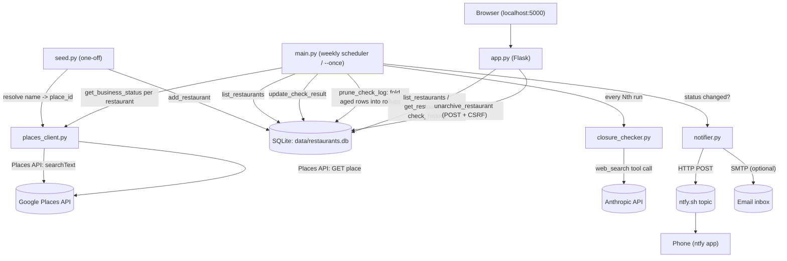

# Restaurant Watcher — Working Plan

_Last reviewed: 2026-09-17, against 7 commits through `dbb0a83` ("Closing gaps")
plus uncommitted work (the dashboard: `app.py`, `templates/`, `db.get_restaurant()`,
`db.unarchive_restaurant()`, `tests/test_app.py`). Measured at that point: 7 modules
(930 lines), 4 templates (270), 5 test files (1330) — the tests are now the largest
part of the repo. This plan tracks open work only; finished items (HTTP retries
everywhere including the Anthropic SDK, the test suite, email notifications, log
pruning, call-time config, `run_check` coverage, the notify-on-transition fixes,
Phase 2's read-only view and its re-activate action) are dropped once done — see git
history for what landed._

## 1. Technical Overview

**Stack:** Python 3.13, SQLite (stdlib `sqlite3`), `requests` for HTTP, `anthropic` SDK,
`apscheduler` for the weekly loop, `python-dotenv` for config, `pytest` for tests,
`flask` for the dashboard (`app.py` + `templates/`, added 2026-09-17 — no longer the
dead dependency it was).

**Core components** (flat, no package structure — one module per role, plus the
dashboard's templates):

| File | Role |
|---|---|
| `main.py` | Orchestrator. Loads env, runs the check loop (once or via `BlockingScheduler`), decides which restaurants get the expensive news check this run, and kicks off log pruning afterwards. Cadence/retention config is read per run via `_closing_soon_check_every()` / `_check_log_retain_days()`. |
| `db.py` | SQLite schema + CRUD. Three tables: `restaurants` (current state), `check_log` (recent per-check history) and `check_log_monthly` (rollups of pruned `check_log` rows). Also `prune_check_log()`, `check_history()`, `get_restaurant()` and `unarchive_restaurant()` (the inverse of `archive_restaurant()`; touches only `archived`). |
| `places_client.py` | Thin wrapper around Google Places API (New): `find_place_id` (seed-time text search) and `get_business_status` (per-run cheap status poll). Retries via a `urllib3` `Retry` adapter. |
| `closure_checker.py` | Calls Claude (`claude-sonnet-4-6`) with the `web_search` tool to judge if a restaurant has announced closure news. Returns structured JSON. Retries/timeout are set explicitly on the SDK client rather than inherited. |
| `notifier.py` | Pushes alerts to a phone via [ntfy.sh](https://ntfy.sh/) (HTTP POST, no auth) and, optionally, by email over SMTP. |
| `seed.py` | One-time/occasional CLI: reads a text file of restaurant names, resolves each to a Google `place_id`, inserts into the DB. |
| `app.py` | Flask dashboard. `/` lists every restaurant with status/last-checked age, `/restaurant/<id>` adds the per-month history, and `POST /restaurant/<id>/unarchive` re-activates an archived one. Reads and writes only through `db.py`; no module-level `app`, so importing it has no side effects (Flask's loader finds `create_app()`). Forms carry a session CSRF token (`DASHBOARD_SECRET_KEY`, generated per process if unset). |
| `templates/` | `base.html` (layout, light/dark tokens, flash messages), `index.html`, `detail.html`, and `_status.html` — macros for the status badges and the re-activate form, shared so the two pages can't disagree about what a state looks like. Presentation decisions that a count on the page also depends on live in `app._view()`, not in the templates. |

**How they fit together:**

Everything is single-threaded, synchronous, and stateless between runs except for what's
persisted in SQLite and a plain-text run counter (`data/.run_count`).

## 2. Current Architecture

### Data flow
1. **Seed once:** `seed.py` reads `restaurants.txt` → `find_place_id()` resolves each line
   to a Google Place ID via Text Search → row inserted into `restaurants`.
2. **Each scheduled run** (`main.run_check`):
   - Increments a persistent run counter (`data/.run_count`) to decide if this is a
     "news check" run (every `CLOSING_SOON_CHECK_EVERY`, default 4).
   - For every active (non-archived) restaurant: fetch `businessStatus` from Places.
   - If operational and it's a news-check run: ask Claude (with web search) whether
     recent coverage suggests an impending closure. A news check that fails after its
     retries is logged and skipped, not fatal: the restaurant keeps the Places status
     just fetched and carries its stored closing-soon flag forward, exactly as on a
     plain run.
   - Write the result to `restaurants` (current state) and append a row to `check_log`
     (history/audit trail).
   - Compare new status to the previously stored status to decide whether to notify.
   - A per-restaurant failure is caught, logged with a traceback and counted, so one bad
     restaurant never aborts the run; the tally is logged at the end.
   - After the loop, `prune_check_log()` folds aged-out `check_log` rows into
     `check_log_monthly` (housekeeping only -- a failure here is logged, not fatal).
3. **Permanent closures auto-archive** the restaurant (`archived = 1`, excluded from
   future `list_restaurants(active_only=True)` calls). Temporary closures and
   closing-soon flags stay active so they keep surfacing on later runs.
4. **Un-archiving is manual** and only from the dashboard, for a place that reopened
   or that Google had wrong. It flips `archived` and nothing else, so it can't
   re-fire a closure alert — but because step 3 keys off the status rather than the
   transition, a row whose stored status is still `CLOSED_PERMANENTLY` gets archived
   again by the next run (silently, since nothing changed). The dashboard warns about
   exactly that case when it happens.

### Test coverage
`tests/` covers `db` (state transitions, pruning, rollups), `closure_checker` (JSON
extraction from messy model output, plus the client's retry/timeout config), `notifier`
(call-time config, email fallbacks, failure isolation) and, as of 2026-09-17,
`main.run_check` — news-check cadence, notify-on-transition, the closing-soon flag,
per-restaurant failure isolation, news-check failure degradation and housekeeping —
and `app` (rendering, sort order, summary counts, archived rows staying visible,
UTC timestamp handling, staleness) — plus the un-archive POST: that it changes only
`archived`, is rejected without a valid CSRF token, is unreachable by GET, warns on a
still-permanently-closed row, and can't be steered into an off-site redirect. Two of
those tests exist to stop specific drift rather than to cover a branch: one posts a
token scraped from a rendered page (the rest seed the session, so nothing else would
notice the form and the check disagreeing), and one asserts the closing-soon count in
the summary matches the badges actually on screen.
`test_main.py` fakes the three external calls and runs against a real temp SQLite file,
so the transitions it asserts are the same reads and writes production does — it caught
two live notification bugs on the way in (both since fixed). `test_app.py` uses the same
real-DB-in-tmp_path setup through Flask's test client. 77 tests, all passing
(`app` 29, `main` 24, `db` 10, `closure_checker` 8, `notifier` 6).
`seed.py` and `places_client.py` remain uncovered (both are thin HTTP wrappers).

### External API integrations
- **Google Places API (New)** — the only restaurant-status source today. Two calls:
  - `places:searchText` (seed time only) — resolves name/address to a `place_id`.
  - `GET /places/{id}` (every run) — field mask kept to `id,businessStatus,displayName` deliberately, to stay in the cheap Essentials/Pro pricing tier (README calls this out explicitly — adding fields like `rating` or `currentOpeningHours` bumps the *entire call* to Enterprise pricing).
  - **No Resy or OpenTable integration exists in this codebase.** `notifier.py`'s docstring references sharing an ntfy topic with "the reservation notifier," implying a separate/sibling tool the user has elsewhere — but reservation-availability watching (Resy/OpenTable) is not implemented here. See Phase 1 below.
- **Anthropic API** — `claude-sonnet-4-6` with the `web_search_20250305` tool, used only for the low-frequency "closing soon" judgment call. Prompted for strict JSON; `closure_checker.py` defensively extracts the `{...}` substring since the model sometimes wraps it in prose.
  - Retries are the SDK's own loop (exponential backoff, honors `retry-after`, covers connection/timeout errors plus 408/409/429/5xx), so there is no `urllib3` adapter to mount here — but `MAX_RETRIES = 3` and `TIMEOUT_SECONDS = 120` are set explicitly on the client instead of inheriting the SDK defaults (2 retries and a 600s read timeout, which would stall the serial loop for ten minutes on one hung request). `tests/test_closure_checker.py` pins both.
  - Failures that survive the retries propagate out of `check_closing_soon()`; the caller decides what they mean (see the data flow above), so a bad Anthropic day costs the news signal, not the status check.

### Notification pipeline
- `notifier.py` fans one `notify()` call out to two sinks:
  - **ntfy** — HTTP POST to `https://ntfy.sh/{NTFY_TOPIC}`, no auth (the topic name is the only "secret"), no delivery confirmation. Retries on 429/5xx via the shared session adapter.
  - **Email (optional)** — SMTP with STARTTLS, active only when `SMTP_HOST`, `EMAIL_FROM` (or `SMTP_USER`) and `EMAIL_TO` are all set; `_email_settings()` returns `None` otherwise and the send is skipped. Failures are caught and logged, so a broken mail server never breaks the ntfy alert or the run.
- Two notification types:
  - `notify_closed` (high priority) — fires on any change *into* `CLOSED_TEMPORARILY`/`CLOSED_PERMANENTLY`, including temporary → permanent, which is a distinct event worth hearing about.
  - `notify_closing_soon` (default priority) — fires when `closing_soon_flag` goes 0 → 1. Only a news check can move that flag; plain runs carry the stored value forward, so the alert is sent once per closure story rather than once per news cycle. A later news check finding no signal clears the flag and re-arms the alert.
- Archiving keys off the status (`CLOSED_PERMANENTLY`), not the transition, so a row stranded active by a failed run still leaves the active list on the next one. Same mechanism re-archives a manually un-archived row whose status hasn't changed — see data flow step 4.
- No dedup/backoff beyond these state-transition checks in `main.py`; no notification log. `tests/test_main.py` is what pins all of this down.

### Gaps / risks worth knowing about
- The dashboard has no auth and binds to localhost only. Fine as-is; it becomes a real decision the moment anyone wants it reachable from a phone, which is also the point where the personal restaurant list stops being local-only data.
- It's served by Flask's development server. Fine for a personal tool on localhost; a real deployment needs a WSGI server in front.
- CSRF tokens live in a session cookie signed with `DASHBOARD_SECRET_KEY`. Unset, a per-process key is generated and open pages stop working after a restart (a reload fixes it). That's the right trade for one user on localhost and the wrong one the moment the app is served to anything else.
- `closing_soon_flag` outlives the closure it predicted. The news check only runs on `OPERATIONAL` restaurants, so once a place is closed the flag freezes at whatever it last was and nothing ever clears it. Harmless today — `notify_closing_soon` only fires on 0 → 1, and the dashboard drops the badge once a place is permanently closed (`_view()`'s `closing_soon_current`) — but it means the stored flag is not a trustworthy "is this place closing" answer on its own, which is worth knowing before anything else reads it.

## 3. Phased Work Plan

### Phase 1 — Reservation availability watching (Resy/OpenTable)
This is the natural "new feature," and matches what `notifier.py`'s docstring implies is a sibling concern:
- New module (e.g. `reservation_client.py`) polling Resy and/or OpenTable for open tables at specific restaurants/party sizes/date windows — useful for hard-to-book places distinct from the "is it still open" check this repo already does.
- Both platforms' consumer APIs are unofficial/reverse-engineered (no public partner API for this use case) — worth explicitly deciding on rate limits, auth/cookie handling, and ToS risk before building, since this is different in kind from the Places API usage above.
- Reuse the existing `restaurants` table (add columns) or a new `reservation_watches` table if watches need their own party-size/date-range/cadence config per restaurant.
- New notification type via the existing `notifier.py` (`notify_table_available`).

### Phase 2 — Dashboard: remaining manual actions
The read-only view and the re-activate action have landed, so `flask` is no longer a
dead dependency and the CSRF plumbing every remaining form needs is in place
(`_csrf_token()` / `_require_csrf()` in `app.py`). Still open:
- **Add a restaurant** from the page instead of editing `restaurants.txt` — wraps
  `find_place_id()` + `add_restaurant()`. Needs a confirm step: Text Search returns a
  best guess, and silently tracking the wrong "Lilia" is the failure mode. This is
  also the first action that spends money (a Text Search call) on a button press.
- **Force a check now** — runs `run_check()` for one restaurant. `run_check` currently
  only does all-or-nothing over the active list and owns the run counter, so a
  single-restaurant path means either a parameter or a narrower extracted helper.
  Doing this from a request thread also makes a page hang on Places/Anthropic latency.
- Auth is still undecided, and is the blocker for serving this anywhere but localhost
  now that buttons on the page change state.

### Phase 3 — Efficiency / scale polish (once restaurant count grows)
- Batch Places status checks if/when Google's API supports it, or at least add concurrency (`concurrent.futures`) to the per-restaurant loop — currently fully serial.
- Per-restaurant check cadence instead of one global schedule (e.g. check closing-soon news more often for restaurants already flagged once).

## 4. Concrete Next Steps (start of next session)
1. Commit the dashboard (`app.py`, `templates/`, `db.get_restaurant()`, `db.unarchive_restaurant()`, `tests/test_app.py`, README + `.env.example`) — the tree has been clean at every other checkpoint.
2. Seed the DB and look at the page against real data. `data/` is still empty, so the dashboard has only ever been rendered against fixtures and a scratch DB — the column widths and the usefulness of the history table are unvalidated at ~100 rows.
3. Decide whether the two remaining manual actions are wanted before Phase 1, since they're what turns the dashboard from a viewer into the place the tool is driven from. "Force a check now" is the one that needs a design decision first (it can't run inline in a request thread without hanging the page).
4. Decide Resy/OpenTable scope for Phase 1 (which platform first, what auth approach) — still the biggest unknown and worth a short spike before committing to a design.
